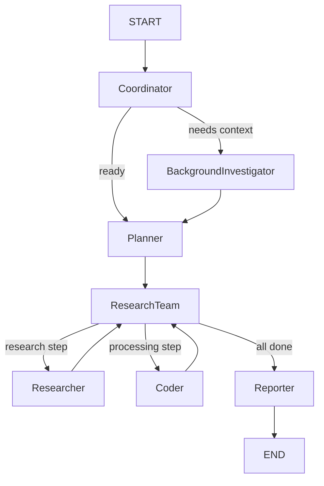
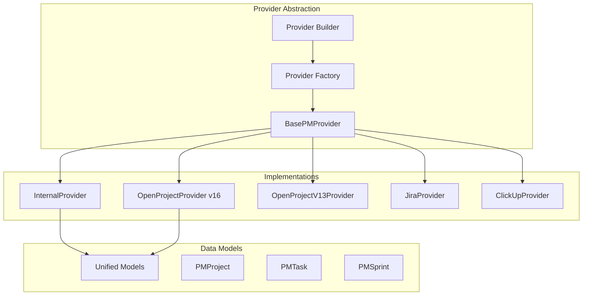

# Backend Components Reference

> **Last Updated**: November 25, 2025

## 📦 Module Structure

```
src/
├── graph/              # LangGraph workflow orchestration
├── conversation/       # Conversation flow management
├── pm_providers/       # PM system integrations
├── analytics/          # Analytics and charts
├── mcp_servers/        # MCP protocol server
├── server/             # FastAPI application
├── tools/              # Agent tools
├── handlers/           # Business logic handlers
├── prompts/            # LLM prompts
├── llms/               # LLM configurations
├── rag/                # RAG and vector search
└── utils/              # Utilities
```

## 🔄 LangGraph Workflow (`src/graph/`)

### Overview
LangGraph orchestrates multi-agent workflows for research and PM tasks.

### Key Files
- **`builder.py`** - Builds the state graph with nodes and edges
- **`nodes.py`** - Defines agent nodes (coordinator, planner, researcher, coder, reporter)
- **`types.py`** - State definitions and type annotations
- **`utils.py`** - Workflow utilities

### Agent Nodes

#### 1. Coordinator Node
```python
def coordinator_node(state: State) -> State:
    """Routes requests to appropriate agents"""
```
- **Purpose**: Entry point for all requests
- **Responsibilities**:
  - Analyze user intent
  - Route to background investigator or planner
  - Handle clarification flow
- **Next Nodes**: `background_investigator`, `planner`, `END`

#### 2. Background Investigator Node
```python
def background_investigation_node(state: State) -> State:
    """Gathers context before planning"""
```
- **Purpose**: Collect background information
- **Tools**: Web search, RAG retrieval
- **Next Node**: `planner`

#### 3. Planner Node
```python
def planner_node(state: State) -> State:
    """Creates research/execution plans"""
```
- **Purpose**: Generate step-by-step plans
- **Outputs**: `Plan` object with research/processing steps
- **Next Node**: `research_team`

#### 4. Research Team Node
```python
def research_team_node(state: State) -> State:
    """Coordinates research execution"""
```
- **Purpose**: Execute plan steps
- **Routes to**: `researcher` (research steps) or `coder` (processing steps)
- **Completion**: Routes to `reporter` when all steps done

#### 5. Researcher Node
```python
def researcher_node(state: State) -> State:
    """Conducts web research"""
```
- **Purpose**: Execute research steps
- **Tools**: Web search, crawling, PM tools, analytics tools
- **Next Node**: `research_team`

#### 6. Coder Node
```python
def coder_node(state: State) -> State:
    """Executes code and calculations"""
```
- **Purpose**: Execute processing steps
- **Tools**: Python REPL, PM tools, backend API
- **Next Node**: `research_team`

#### 7. Reporter Node
```python
def reporter_node(state: State) -> State:
    """Generates final reports"""
```
- **Purpose**: Create comprehensive responses
- **Outputs**: Final report/answer
- **Next Node**: `END`

### Workflow Flow



### State Management

```python
class State(TypedDict):
    messages: List[BaseMessage]
    current_plan: Optional[Plan]
    observations: List[str]
    goto: str
    # ... more fields
```

## 💬 Conversation Flow Manager (`src/conversation/`)

### Overview
Manages adaptive conversations for PM tasks with progressive context gathering.

### Key Files
- **`flow_manager.py`** - Main conversation orchestrator
- **`self_learning.py`** - Learn from user feedback

### Intent Classification

Supported intents (20+):
```python
class Intent(Enum):
    CREATE_PROJECT = "create_project"
    PLAN_TASKS = "plan_tasks"
    RESEARCH_TOPIC = "research_topic"
    CREATE_WBS = "create_wbs"
    SPRINT_PLANNING = "sprint_planning"
    ASSIGN_TASKS = "assign_tasks"
    LIST_PROJECTS = "list_projects"
    LIST_TASKS = "list_tasks"
    GET_PROJECT_STATUS = "get_project_status"
    SWITCH_PROJECT = "switch_project"
    UPDATE_TASK = "update_task"
    # ... more intents
```

### Context Gathering Flow

```python
class ConversationFlowManager:
    async def process_message(
        self, 
        user_message: str, 
        session_id: str
    ) -> ConversationResponse:
        """Process user message with context gathering"""
        
        # 1. Classify intent
        intent = await self._classify_intent(user_message)
        
        # 2. Extract entities
        entities = await self._extract_entities(user_message, intent)
        
        # 3. Check completeness
        missing_fields = self._check_required_fields(intent, entities)
        
        # 4. Ask clarifying questions if needed
        if missing_fields:
            return self._generate_clarification_question(missing_fields)
        
        # 5. Execute action
        return await self._execute_intent(intent, entities)
```

### Required Fields by Intent

```python
REQUIRED_FIELDS = {
    Intent.CREATE_PROJECT: [
        "name", "description", "domain", 
        "timeline", "team_size"
    ],
    Intent.SPRINT_PLANNING: [
        "project_id", "sprint_duration", 
        "team_capacity", "tasks"
    ],
    # ... more mappings
}
```

## 🔌 PM Providers (`src/pm_providers/`)

### Architecture



### Base Provider Interface

```python
class BasePMProvider(ABC):
    """Base interface for all PM providers"""
    
    # Projects
    @abstractmethod
    async def list_projects(self) -> List[PMProject]:
        pass
    
    @abstractmethod
    async def get_project(self, project_id: str) -> PMProject:
        pass
    
    @abstractmethod
    async def create_project(self, project: PMProject) -> PMProject:
        pass
    
    # Tasks
    @abstractmethod
    async def list_tasks(
        self, 
        project_id: Optional[str] = None
    ) -> List[PMTask]:
        pass
    
    # Sprints
    @abstractmethod
    async def list_sprints(
        self, 
        project_id: Optional[str] = None
    ) -> List[PMSprint]:
        pass
    
    # ... more methods
```

### Unified Data Models

```python
@dataclass
class PMProject:
    id: str
    name: str
    description: Optional[str]
    status: str
    priority: Optional[str]
    start_date: Optional[datetime]
    end_date: Optional[datetime]
    created_at: datetime
    updated_at: datetime
    provider_type: str
    provider_id: str

@dataclass
class PMTask:
    id: str
    title: str
    description: Optional[str]
    project_id: str
    status: str
    priority: Optional[str]
    assignee_id: Optional[str]
    sprint_id: Optional[str]
    estimated_hours: Optional[float]
    actual_hours: Optional[float]
    # ... more fields
```

### Provider Factory

```python
def create_pm_provider(
    provider_type: str,
    config: ProviderConfig
) -> BasePMProvider:
    """Factory to create provider instances"""
    
    providers = {
        "internal": InternalProvider,
        "openproject": OpenProjectProvider,
        "openproject_v13": OpenProjectV13Provider,
        "jira": JiraProvider,
        "clickup": ClickUpProvider,
    }
    
    provider_class = providers.get(provider_type)
    if not provider_class:
        raise ValueError(f"Unknown provider: {provider_type}")
    
    return provider_class(config)
```

## 📊 Analytics Module (`src/analytics/`)

### Structure

```
analytics/
├── service.py          # Main analytics service
├── models.py           # Pydantic models
├── mock_data.py        # Test data generator
├── calculators/        # Chart calculators
│   ├── burndown.py
│   ├── velocity.py
│   ├── sprint_report.py
│   ├── cfd.py
│   ├── cycle_time.py
│   └── work_distribution.py
└── adapters/           # Data source adapters
    ├── base.py
    └── pm_adapter.py
```

### Analytics Service

```python
class AnalyticsService:
    def __init__(self, data_source: str = "pm_providers"):
        self.adapter = self._create_adapter(data_source)
    
    def get_burndown_chart(
        self, 
        project_id: str, 
        sprint_id: str
    ) -> ChartResponse:
        """Generate burndown chart"""
        data = self.adapter.get_sprint_data(project_id, sprint_id)
        return BurndownCalculator.calculate(data)
    
    def get_velocity_chart(
        self, 
        project_id: str, 
        sprint_count: int = 6
    ) -> ChartResponse:
        """Generate velocity chart"""
        data = self.adapter.get_velocity_data(project_id, sprint_count)
        return VelocityCalculator.calculate(data)
```

### Chart Response Model

```python
class ChartResponse(BaseModel):
    chart_type: str
    title: str
    data: Dict[str, Any]
    metadata: Dict[str, Any]
    generated_at: datetime
```

## 🛠️ Tools Module (`src/tools/`)

### Available Tools

#### PM Tools (`pm_tools.py`)
```python
@tool
def list_pm_projects() -> str:
    """List all projects from PM providers"""

@tool
def create_pm_task(
    project_id: str,
    title: str,
    description: str,
    **kwargs
) -> str:
    """Create a new task"""

@tool
def list_my_tasks(project_id: Optional[str] = None) -> str:
    """List tasks assigned to current user"""
```

#### Analytics Tools (`analytics_tools.py`)
```python
@tool
def get_sprint_burndown(
    project_id: str, 
    sprint_id: str
) -> str:
    """Get burndown chart for sprint"""

@tool
def get_team_velocity(
    project_id: str, 
    sprint_count: int = 6
) -> str:
    """Get team velocity over sprints"""
```

#### Search Tools (`search.py`)
```python
@tool
def web_search(query: str, max_results: int = 5) -> str:
    """Search the web using configured search engine"""
```

#### Code Execution (`python_repl.py`)
```python
@tool
def python_repl(code: str) -> str:
    """Execute Python code safely"""
```

## 🌐 MCP Server (`src/mcp_servers/pm_server/`)

### Architecture

```
pm_server/
├── server.py           # MCP server implementation
├── tools/              # MCP tool definitions
├── auth/               # Authentication
├── transports/         # stdio, HTTP, SSE
└── pm_handler.py       # Unified PM operations
```

### MCP Server Implementation

```python
class PMServer:
    def __init__(self, transport: str = "sse"):
        self.transport = transport
        self.tools = self._register_tools()
    
    async def handle_tool_call(
        self, 
        tool_name: str, 
        arguments: Dict[str, Any]
    ) -> ToolResponse:
        """Handle MCP tool calls"""
        tool = self.tools.get(tool_name)
        if not tool:
            raise ToolNotFoundError(tool_name)
        
        return await tool.execute(arguments)
```

### Transports

1. **stdio**: Standard input/output
2. **HTTP**: REST API endpoints
3. **SSE**: Server-Sent Events for streaming

---

**Next**: [Frontend Architecture →](./03_frontend_architecture.md)
