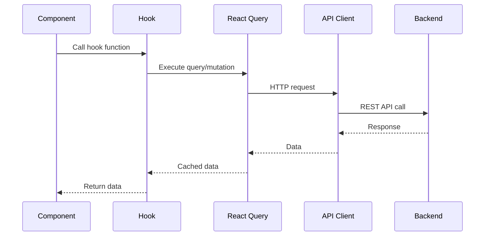
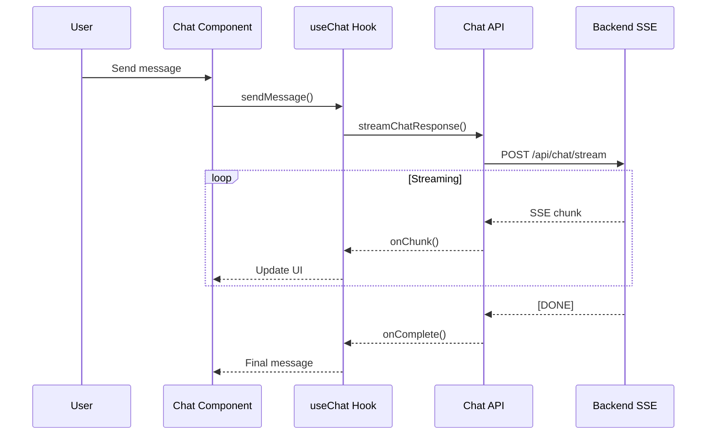

# Frontend Architecture Reference

> **Last Updated**: November 25, 2025

## 📦 Structure Overview

```
web/
├── src/
│   ├── app/              # Next.js App Router pages
│   │   ├── pm/           # PM-specific pages
│   │   │   ├── chat/     # Chat interface
│   │   │   ├── charts/   # Analytics charts
│   │   │   └── overview/ # Dashboard
│   │   └── page.tsx      # Home page
│   ├── components/       # Reusable components
│   ├── core/             # Core utilities
│   │   ├── api/          # API client
│   │   ├── store/        # State management
│   │   └── types/        # TypeScript types
│   ├── hooks/            # Custom React hooks
│   └── styles/           # Global styles
├── public/               # Static assets
└── package.json
```

## 🎨 Tech Stack

- **Framework**: Next.js 14 (App Router)
- **Language**: TypeScript
- **Styling**: TailwindCSS
- **State Management**: Zustand
- **Data Fetching**: React Query (TanStack Query)
- **Chat UI**: OpenAI ChatKit
- **Charts**: Recharts / Chart.js
- **WebSocket**: Socket.io-client

## 🔌 API Integration (`web/src/core/api/`)

### API Client

```typescript
// web/src/core/api/client.ts
import axios from 'axios';

const apiClient = axios.create({
  baseURL: process.env.NEXT_PUBLIC_API_URL || 'http://localhost:8000',
  headers: {
    'Content-Type': 'application/json',
  },
});

// Request interceptor for auth
apiClient.interceptors.request.use((config) => {
  const token = localStorage.getItem('auth_token');
  if (token) {
    config.headers.Authorization = `Bearer ${token}`;
  }
  return config;
});

export default apiClient;
```

### Chat API (`web/src/core/api/chat.ts`)

```typescript
export interface ChatMessage {
  role: 'user' | 'assistant' | 'system';
  content: string;
  metadata?: Record<string, any>;
}

export interface ChatStreamOptions {
  messages: ChatMessage[];
  sessionId?: string;
  onChunk?: (chunk: string) => void;
  onComplete?: (fullResponse: string) => void;
  onError?: (error: Error) => void;
}

export async function streamChatResponse(
  options: ChatStreamOptions
): Promise<void> {
  const { messages, sessionId, onChunk, onComplete, onError } = options;

  try {
    const response = await fetch('/api/chat/stream', {
      method: 'POST',
      headers: {
        'Content-Type': 'application/json',
      },
      body: JSON.stringify({
        messages,
        session_id: sessionId,
      }),
    });

    if (!response.ok) {
      throw new Error(`HTTP error! status: ${response.status}`);
    }

    const reader = response.body?.getReader();
    const decoder = new TextDecoder();
    let fullResponse = '';

    while (true) {
      const { done, value } = await reader!.read();
      if (done) break;

      const chunk = decoder.decode(value);
      const lines = chunk.split('\n');

      for (const line of lines) {
        if (line.startsWith('data: ')) {
          const data = line.slice(6);
          if (data === '[DONE]') continue;

          try {
            const parsed = JSON.parse(data);
            if (parsed.content) {
              fullResponse += parsed.content;
              onChunk?.(parsed.content);
            }
          } catch (e) {
            console.error('Failed to parse SSE data:', e);
          }
        }
      }
    }

    onComplete?.(fullResponse);
  } catch (error) {
    onError?.(error as Error);
  }
}
```

### PM API (`web/src/core/api/pm.ts`)

```typescript
export interface Project {
  id: string;
  name: string;
  description?: string;
  status: string;
  priority?: string;
  start_date?: string;
  end_date?: string;
  provider_type: string;
}

export interface Task {
  id: string;
  title: string;
  description?: string;
  project_id: string;
  status: string;
  priority?: string;
  assignee_id?: string;
  sprint_id?: string;
  estimated_hours?: number;
  actual_hours?: number;
}

// Projects
export async function listProjects(): Promise<Project[]> {
  const response = await apiClient.get('/api/pm/projects');
  return response.data;
}

export async function getProject(projectId: string): Promise<Project> {
  const response = await apiClient.get(`/api/pm/projects/${projectId}`);
  return response.data;
}

export async function createProject(project: Partial<Project>): Promise<Project> {
  const response = await apiClient.post('/api/pm/projects', project);
  return response.data;
}

// Tasks
export async function listTasks(projectId?: string): Promise<Task[]> {
  const url = projectId 
    ? `/api/pm/projects/${projectId}/tasks`
    : '/api/pm/tasks';
  const response = await apiClient.get(url);
  return response.data;
}

export async function createTask(
  projectId: string,
  task: Partial<Task>
): Promise<Task> {
  const response = await apiClient.post(
    `/api/pm/projects/${projectId}/tasks`,
    task
  );
  return response.data;
}
```

## 🗄️ State Management (`web/src/core/store/`)

### Store Architecture

```typescript
// web/src/core/store/store.ts
import { create } from 'zustand';
import { persist } from 'zustand/middleware';

interface AppState {
  // User state
  user: User | null;
  setUser: (user: User | null) => void;

  // Project context
  currentProject: Project | null;
  setCurrentProject: (project: Project | null) => void;

  // Chat state
  chatMessages: ChatMessage[];
  addChatMessage: (message: ChatMessage) => void;
  clearChatMessages: () => void;

  // UI state
  sidebarOpen: boolean;
  toggleSidebar: () => void;
}

export const useAppStore = create<AppState>()(
  persist(
    (set) => ({
      // User
      user: null,
      setUser: (user) => set({ user }),

      // Project
      currentProject: null,
      setCurrentProject: (project) => set({ currentProject: project }),

      // Chat
      chatMessages: [],
      addChatMessage: (message) =>
        set((state) => ({
          chatMessages: [...state.chatMessages, message],
        })),
      clearChatMessages: () => set({ chatMessages: [] }),

      // UI
      sidebarOpen: true,
      toggleSidebar: () =>
        set((state) => ({ sidebarOpen: !state.sidebarOpen })),
    }),
    {
      name: 'pm-agent-storage',
      partialize: (state) => ({
        user: state.user,
        currentProject: state.currentProject,
        sidebarOpen: state.sidebarOpen,
      }),
    }
  )
);
```

## 🎯 Custom Hooks (`web/src/hooks/`)

### useProjects Hook

```typescript
// web/src/hooks/useProjects.ts
import { useQuery, useMutation, useQueryClient } from '@tanstack/react-query';
import { listProjects, createProject, Project } from '@/core/api/pm';

export function useProjects() {
  const queryClient = useQueryClient();

  const { data: projects, isLoading, error } = useQuery({
    queryKey: ['projects'],
    queryFn: listProjects,
    staleTime: 5 * 60 * 1000, // 5 minutes
  });

  const createMutation = useMutation({
    mutationFn: createProject,
    onSuccess: () => {
      queryClient.invalidateQueries({ queryKey: ['projects'] });
    },
  });

  return {
    projects: projects || [],
    isLoading,
    error,
    createProject: createMutation.mutate,
    isCreating: createMutation.isPending,
  };
}
```

### useChat Hook

```typescript
// web/src/hooks/useChat.ts
import { useState, useCallback } from 'react';
import { streamChatResponse, ChatMessage } from '@/core/api/chat';
import { useAppStore } from '@/core/store/store';

export function useChat() {
  const [isStreaming, setIsStreaming] = useState(false);
  const { chatMessages, addChatMessage } = useAppStore();

  const sendMessage = useCallback(async (content: string) => {
    // Add user message
    const userMessage: ChatMessage = {
      role: 'user',
      content,
    };
    addChatMessage(userMessage);

    // Start streaming assistant response
    setIsStreaming(true);
    let assistantContent = '';

    await streamChatResponse({
      messages: [...chatMessages, userMessage],
      onChunk: (chunk) => {
        assistantContent += chunk;
      },
      onComplete: (fullResponse) => {
        addChatMessage({
          role: 'assistant',
          content: fullResponse,
        });
        setIsStreaming(false);
      },
      onError: (error) => {
        console.error('Chat error:', error);
        setIsStreaming(false);
      },
    });
  }, [chatMessages, addChatMessage]);

  return {
    messages: chatMessages,
    sendMessage,
    isStreaming,
  };
}
```

## 🎨 Key Components

### Chat Interface (`web/src/app/pm/chat/`)

```typescript
// web/src/app/pm/chat/components/message-list-view.tsx
import { ChatMessage } from '@/core/api/chat';
import { MessageBubble } from './message-bubble';

interface MessageListViewProps {
  messages: ChatMessage[];
  isStreaming?: boolean;
}

export function MessageListView({ 
  messages, 
  isStreaming 
}: MessageListViewProps) {
  return (
    <div className="flex flex-col space-y-4 p-4">
      {messages.map((message, index) => (
        <MessageBubble
          key={index}
          message={message}
          isLast={index === messages.length - 1}
        />
      ))}
      {isStreaming && (
        <div className="flex items-center space-x-2">
          <div className="animate-pulse">●</div>
          <span className="text-sm text-gray-500">AI is thinking...</span>
        </div>
      )}
    </div>
  );
}
```

### Project Dashboard (`web/src/app/pm/overview/`)

```typescript
// web/src/app/pm/overview/page.tsx
'use client';

import { useProjects } from '@/hooks/useProjects';
import { ProjectCard } from '@/components/project-card';
import { CreateProjectButton } from '@/components/create-project-button';

export default function OverviewPage() {
  const { projects, isLoading } = useProjects();

  if (isLoading) {
    return <div>Loading projects...</div>;
  }

  return (
    <div className="container mx-auto p-6">
      <div className="flex justify-between items-center mb-6">
        <h1 className="text-3xl font-bold">Projects</h1>
        <CreateProjectButton />
      </div>

      <div className="grid grid-cols-1 md:grid-cols-2 lg:grid-cols-3 gap-6">
        {projects.map((project) => (
          <ProjectCard key={project.id} project={project} />
        ))}
      </div>
    </div>
  );
}
```

### Analytics Charts (`web/src/app/pm/charts/`)

```typescript
// web/src/app/pm/charts/burndown.tsx
import { useQuery } from '@tanstack/react-query';
import { Line } from 'react-chartjs-2';
import apiClient from '@/core/api/client';

interface BurndownChartProps {
  projectId: string;
  sprintId: string;
}

export function BurndownChart({ projectId, sprintId }: BurndownChartProps) {
  const { data, isLoading } = useQuery({
    queryKey: ['burndown', projectId, sprintId],
    queryFn: async () => {
      const response = await apiClient.get(
        `/api/analytics/projects/${projectId}/burndown`,
        { params: { sprint_id: sprintId } }
      );
      return response.data;
    },
  });

  if (isLoading) return <div>Loading chart...</div>;

  const chartData = {
    labels: data.data.dates,
    datasets: [
      {
        label: 'Ideal Burndown',
        data: data.data.ideal,
        borderColor: 'rgb(75, 192, 192)',
        backgroundColor: 'rgba(75, 192, 192, 0.2)',
      },
      {
        label: 'Actual Burndown',
        data: data.data.actual,
        borderColor: 'rgb(255, 99, 132)',
        backgroundColor: 'rgba(255, 99, 132, 0.2)',
      },
    ],
  };

  return (
    <div className="bg-white p-6 rounded-lg shadow">
      <h2 className="text-xl font-semibold mb-4">{data.title}</h2>
      <Line data={chartData} />
    </div>
  );
}
```

## 🔄 Data Flow

### Component → API → Backend



### Chat Streaming Flow



---

**Next**: [API Reference →](./04_api_reference.md)
