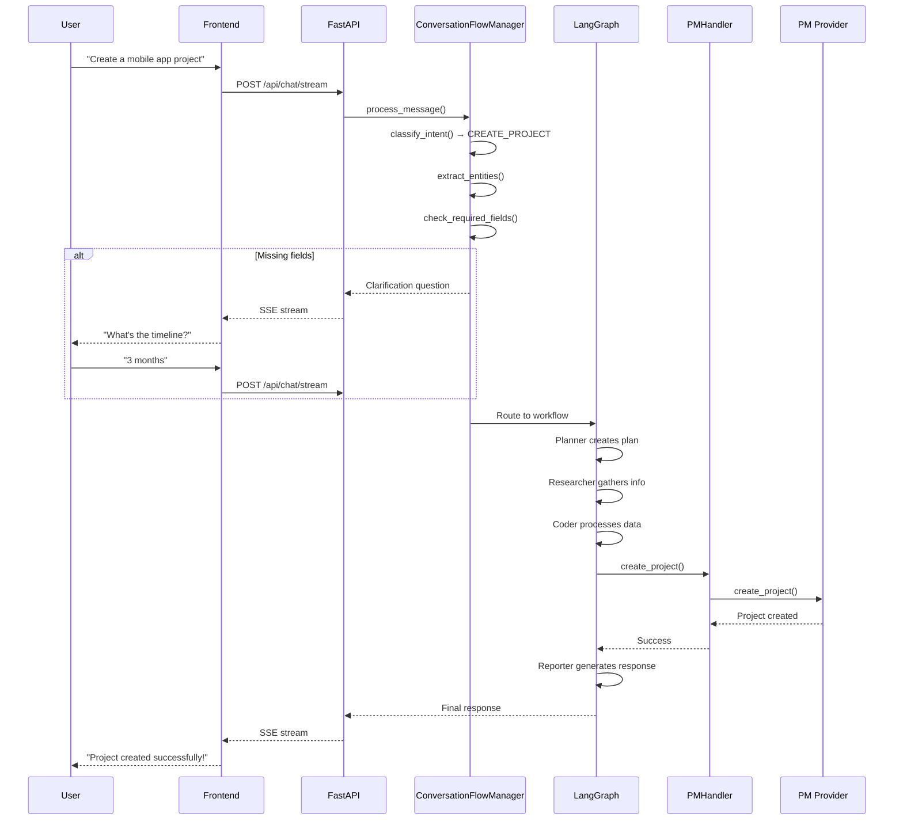
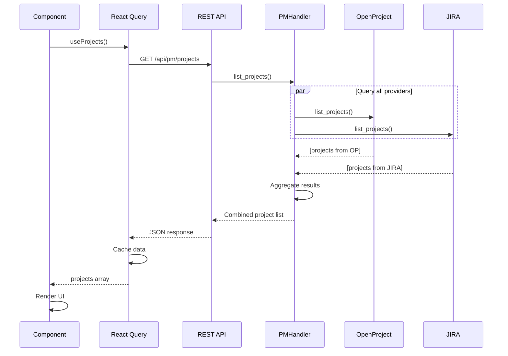
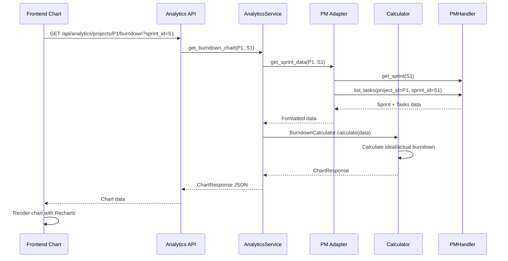
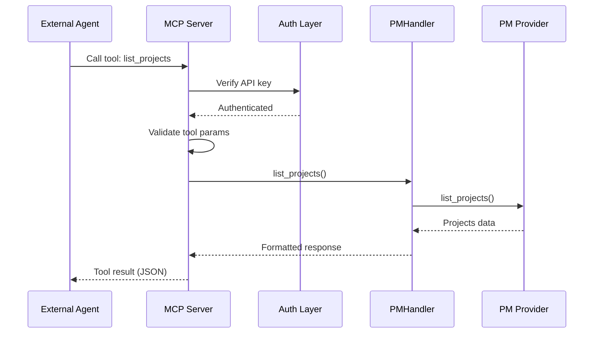
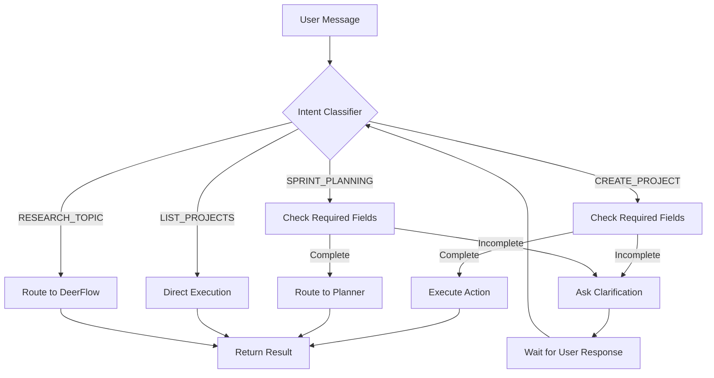
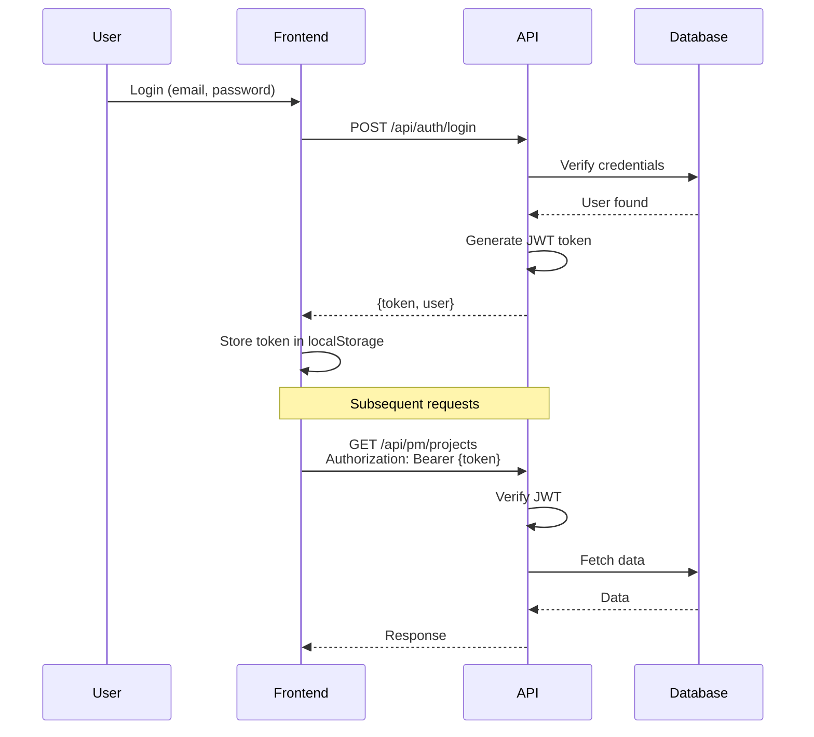
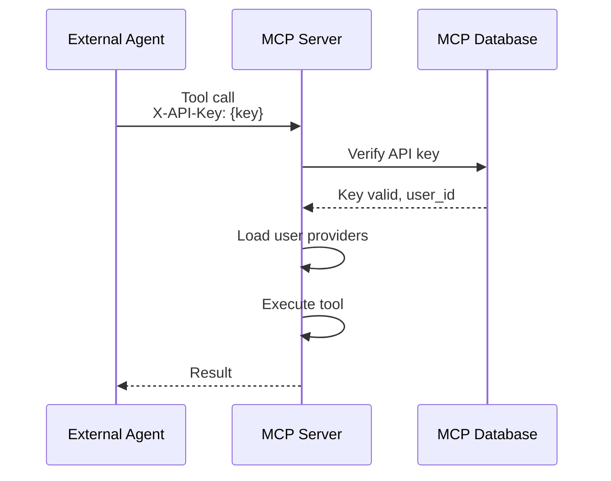
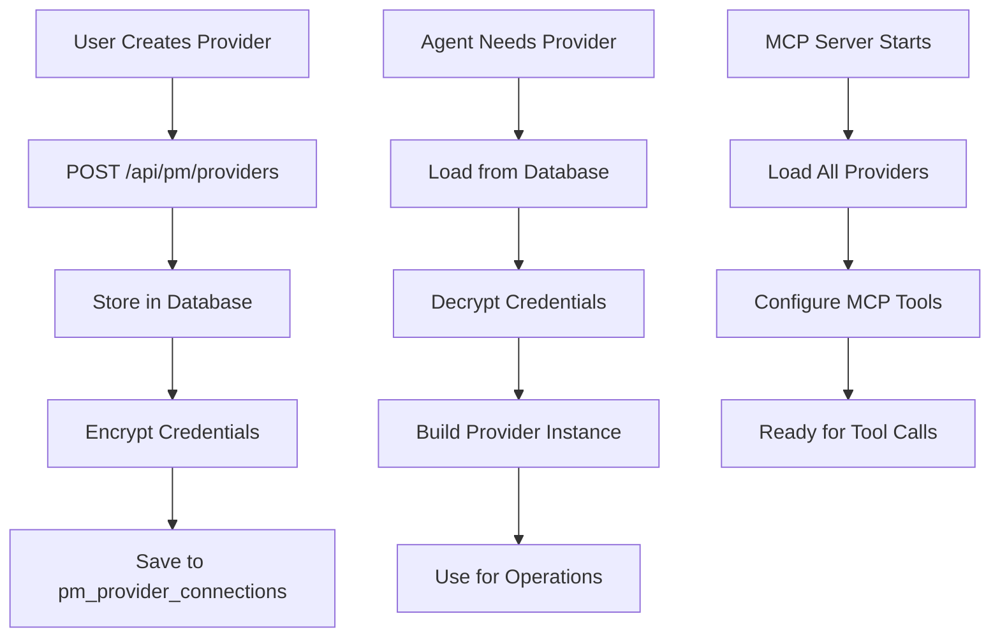
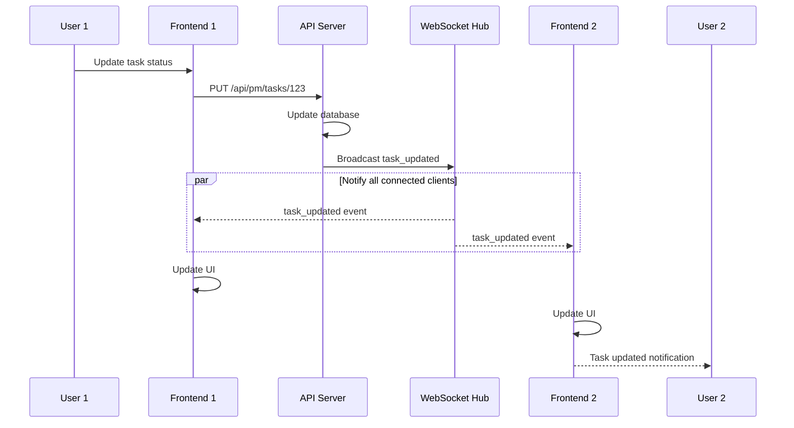

# Key Workflows and Data Flows

> **Last Updated**: November 25, 2025

## 🔄 Core Workflows

### 1. User Chat → Research → PM Action

This is the primary workflow for conversational PM operations.



### 2. Frontend Dashboard → REST API → PM Providers

Direct data fetching for UI components.



### 3. Analytics Chart Generation

Server-side chart data generation.



### 4. MCP Tool Call Flow

External agents calling PM tools via MCP.



## 📊 Data Flow Patterns

### Pattern 1: Multi-Provider Aggregation

**Use Case**: Frontend needs to show all projects from all providers

```python
# PMHandler in multi-provider mode
class PMHandler:
    def __init__(self, db_session, user_id):
        self.providers = self._load_user_providers(db_session, user_id)
    
    async def list_projects(self):
        all_projects = []
        for provider in self.providers:
            projects = await provider.list_projects()
            all_projects.extend(projects)
        return all_projects
```

**Flow**:
```
Frontend → API → PMHandler (multi-provider)
                    ↓
    ┌───────────────┼───────────────┐
    ↓               ↓               ↓
OpenProject 1   OpenProject 2    JIRA
    ↓               ↓               ↓
    └───────────────┼───────────────┘
                    ↓
            Aggregate & Return
```

### Pattern 2: Single-Provider Context

**Use Case**: Agent working within a specific provider context

```python
# PMHandler in single-provider mode
provider = build_pm_provider(db_session, provider_name="OpenProject Main")
handler = PMHandler.from_single_provider(provider)

# All operations use this one provider
projects = await handler.list_projects()
```

**Flow**:
```
Agent → Tool → PMHandler (single-provider)
                    ↓
              OpenProject
                    ↓
                Return
```

### Pattern 3: Streaming Response

**Use Case**: Real-time chat with progressive updates

```python
async def stream_chat():
    async for event in graph.astream_events(...):
        if event["event"] == "on_chat_model_stream":
            yield f"data: {json.dumps(event)}\n\n"
```

**Flow**:
```
User Message
    ↓
LangGraph Workflow
    ↓
┌───┴────┐
│ Agent  │ → Streams chunks
└───┬────┘
    ↓
SSE Stream → Frontend
    ↓
Progressive UI Update
```

### Pattern 4: Background Task Processing

**Use Case**: Long-running operations (WBS generation, sprint planning)

```python
from celery import Celery

@celery.task
async def generate_wbs(project_id: str):
    # Long-running task
    wbs = await wbs_generator.generate(project_id)
    return wbs

# Trigger
task = generate_wbs.delay(project_id)
task_id = task.id

# Poll for result
result = AsyncResult(task_id)
if result.ready():
    wbs = result.get()
```

**Flow**:
```
User Request
    ↓
API → Celery Task (async)
    ↓
Return task_id immediately
    ↓
Frontend polls for status
    ↓
Task completes → Return result
```

## 🔄 State Management Flows

### LangGraph State Flow

```python
class State(TypedDict):
    messages: List[BaseMessage]
    current_plan: Optional[Plan]
    observations: List[str]
    goto: str
```

**State Transitions**:
```
Initial State
    ↓
Coordinator → Add messages, set goto
    ↓
Planner → Create plan, add to current_plan
    ↓
Research Team → Execute steps, add observations
    ↓
Reporter → Generate final response
    ↓
Final State
```

### Frontend State Flow (Zustand)

```typescript
interface AppState {
  user: User | null;
  currentProject: Project | null;
  chatMessages: ChatMessage[];
}
```

**State Updates**:
```
User Login
    ↓
setUser(user) → Update store
    ↓
Select Project
    ↓
setCurrentProject(project) → Update store
    ↓
Send Chat Message
    ↓
addChatMessage(message) → Update store
    ↓
Components re-render
```

## 🎯 Intent Classification Flow



## 🔐 Authentication Flow

### JWT Authentication



### MCP API Key Authentication



## 📦 Provider Configuration Flow



## 🔄 Real-time Update Flow (WebSocket)



---

**Next**: [Troubleshooting Guide →](./08_troubleshooting.md)
