# Project Management Agent - Architecture Deep Dive

## 🎯 System Architecture

### Complete System Overview

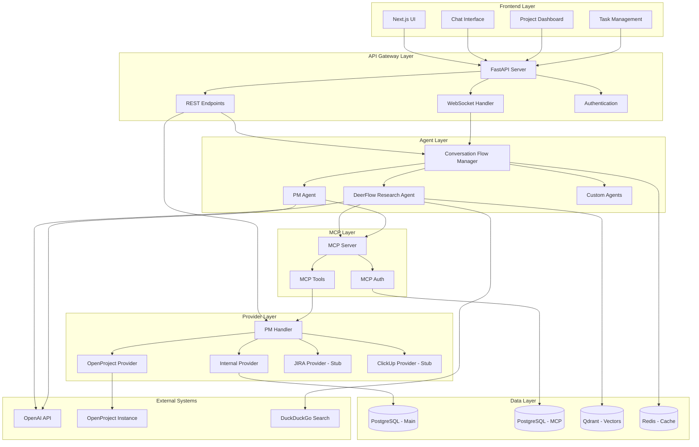

## 🔄 Data Flow Patterns

### Pattern 1: Research Query Flow

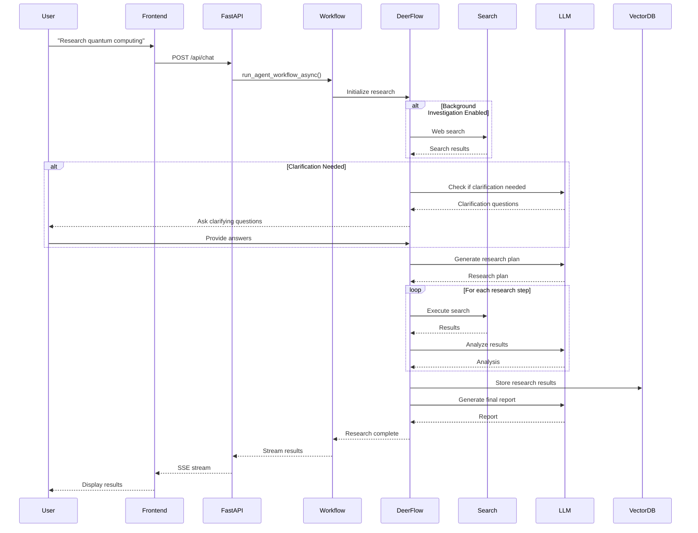

### Pattern 2: Direct PM Operation (UI)

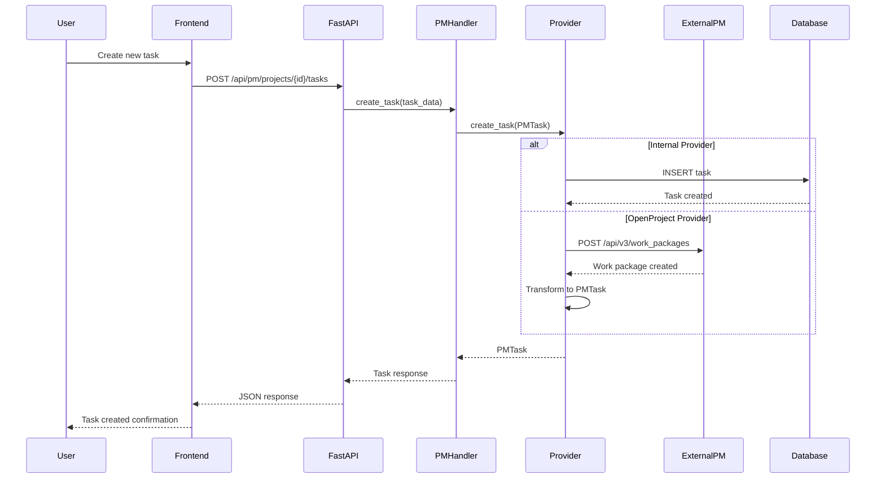

### Pattern 3: Conversational PM Operation (MCP)

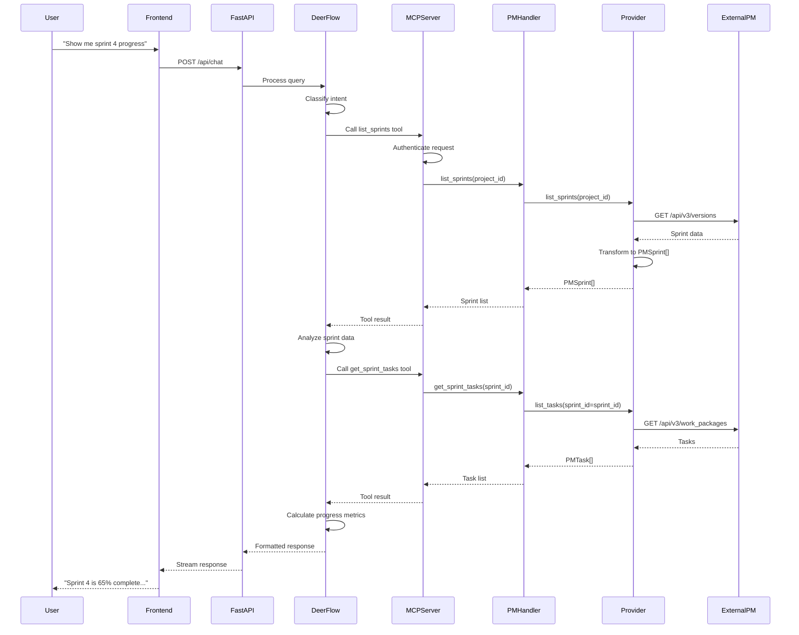

## 🗄️ Database Architecture

### Main Database Schema

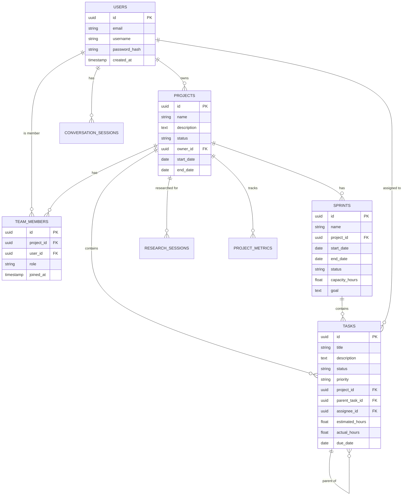

### MCP Database Schema

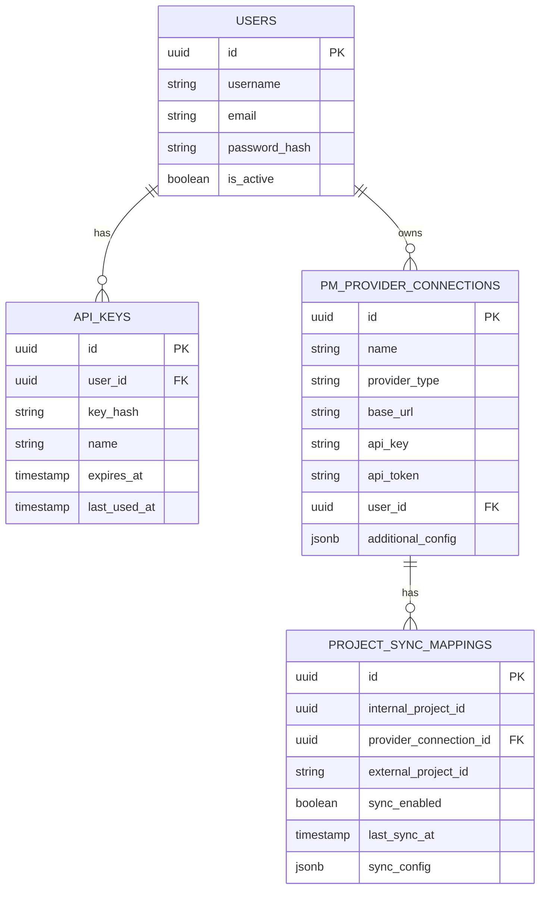

## 🔧 Component Details

### 1. DeerFlow Workflow

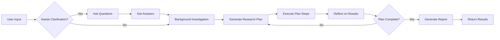

### 2. PM Provider Architecture

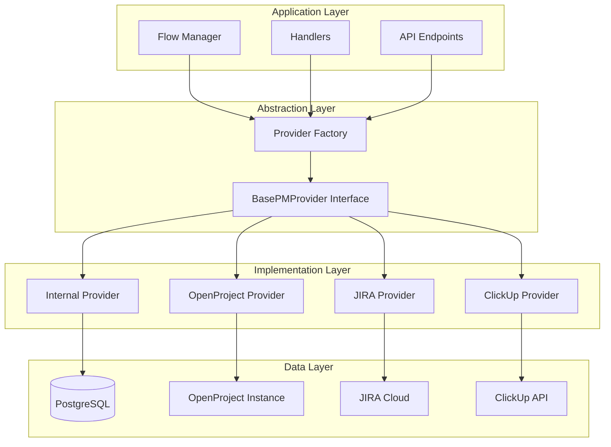

### 3. MCP Server Architecture

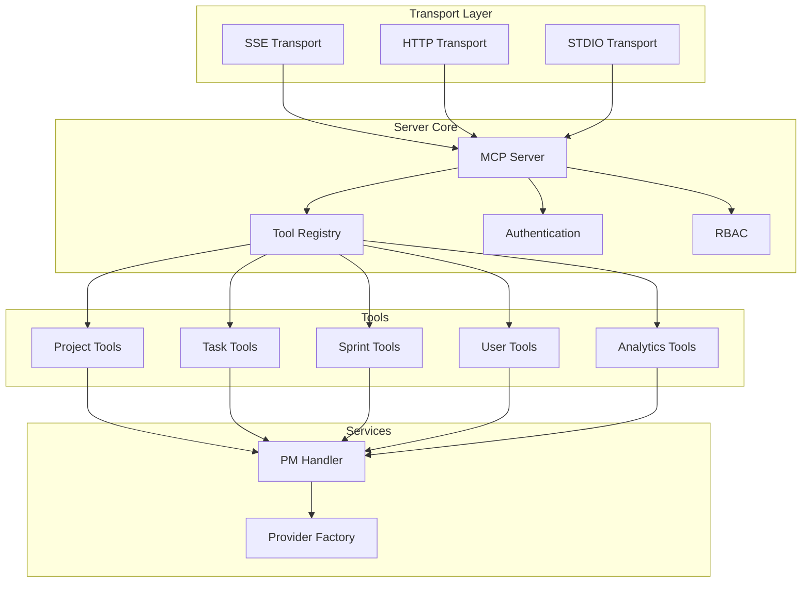

## 🚀 Deployment Architecture

### Docker Compose Services

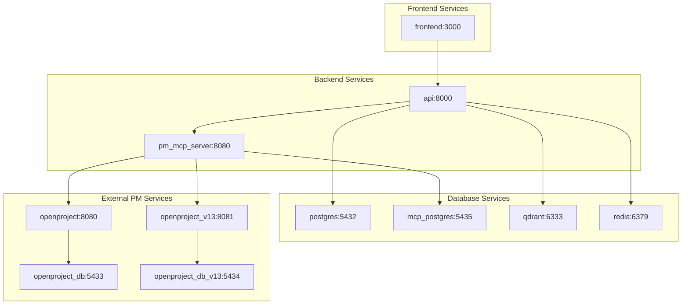

## 🔐 Authentication & Authorization Flow

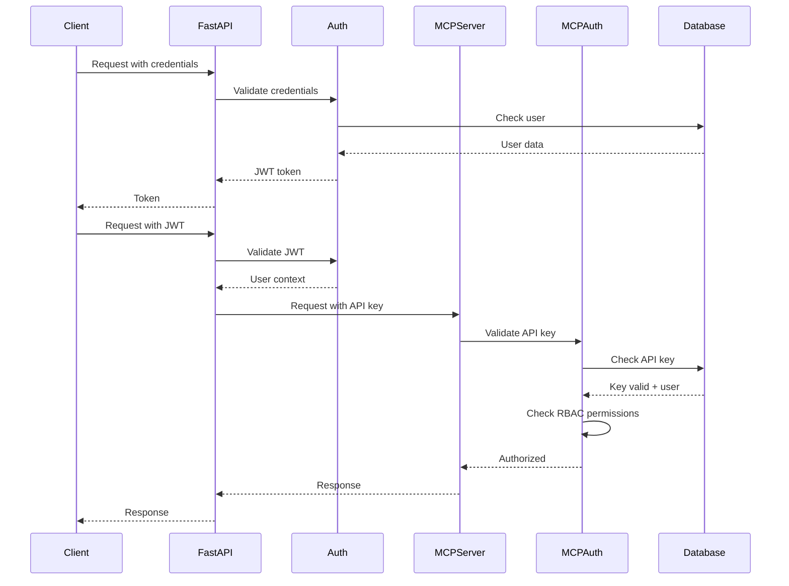

## 📊 Agent Workflow States

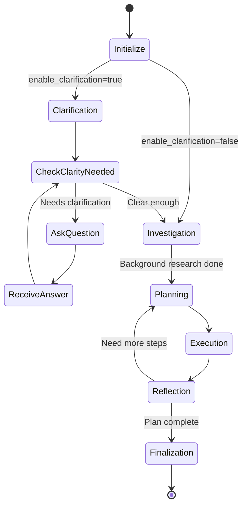

## 🎯 Key Design Patterns

### 1. Factory Pattern (PM Providers)
```python
# Factory creates appropriate provider based on config
provider = build_pm_provider(db_session=db)
# Returns: InternalProvider | OpenProjectProvider | JiraProvider | ClickUpProvider
```

### 2. Strategy Pattern (Transports)
```python
# MCP Server can use different transport strategies
transport = SSETransport()  # or HTTPTransport() or StdioTransport()
server.run(transport)
```

### 3. Adapter Pattern (PM Provider Interface)
```python
# Each provider adapts its API to the common interface
class OpenProjectProvider(BasePMProvider):
    async def create_task(self, task: PMTask) -> PMTask:
        # Adapt PMTask to OpenProject work package format
        op_data = self._to_openproject_format(task)
        result = await self.client.post("/work_packages", op_data)
        # Adapt OpenProject response back to PMTask
        return self._from_openproject_format(result)
```

### 4. Observer Pattern (WebSocket Updates)
```python
# Frontend subscribes to real-time updates
websocket.on('task_updated', handleTaskUpdate)
# Backend publishes updates
await websocket.emit('task_updated', task_data)
```

## 🔍 Code Organization Principles

### Separation of Concerns
- **Presentation**: Frontend (Next.js)
- **API**: FastAPI server
- **Business Logic**: Handlers, Services
- **Data Access**: Providers, CRUD
- **AI/ML**: Agents, Workflows
- **Infrastructure**: Database, Cache, MCP

### Dependency Flow
```
Frontend → API → Handlers → Services → Providers → External Systems
                    ↓
                 Agents → MCP Server → Providers
```

### Configuration Hierarchy
```
Environment Variables (.env)
    ↓
Runtime Config (conf.yaml)
    ↓
Code Defaults
```

## 🎓 Understanding the Codebase

### Critical Files to Master

1. **Entry Points**
   - `main.py` - CLI research mode
   - `server.py` - API server startup
   - `src/workflow.py` - Agent workflow orchestration

2. **Core Logic**
   - `src/server/app.py` - All API endpoints (151KB!)
   - `pm_providers/base.py` - Provider interface
   - `mcp_server/server.py` - MCP protocol implementation

3. **Data Models**
   - `database/models.py` - Pydantic models
   - `database/orm_models.py` - SQLAlchemy models
   - `pm_providers/models.py` - PM data models

4. **Configuration**
   - `pyproject.toml` - Dependencies
   - `docker-compose.yml` - Services
   - `database/schema.sql` - Database structure

### Code Reading Order

**For Backend Developers:**
1. Read `README.md` for overview
2. Study `docker-compose.yml` to understand services
3. Review `database/schema.sql` for data model
4. Explore `pm_providers/base.py` for abstraction
5. Read `src/server/app.py` for API endpoints
6. Study `src/workflow.py` for agent logic

**For AI/ML Developers:**
1. Start with `src/workflow.py`
2. Explore `src/graph/` for LangGraph
3. Review `src/agents/` for agent implementations
4. Study `src/prompts/` for LLM prompts
5. Check `src/tools/` for agent tools

**For Full Stack Developers:**
1. Review `docker-compose.yml` for full picture
2. Study `src/server/app.py` for backend API
3. Explore `web/src/app/` for frontend pages
4. Check `web/src/components/` for UI components
5. Review API integration in `web/src/lib/`

---

**Last Updated**: 2025-11-22
