# PM Agent Architecture Overview

## Flow Diagram

```mermaid
flowchart TD
    A["🗣️ User Message"] --> B["📋 Coordinator"]
    
    B --> C{"🔍 Intent Detection"}
    C -->|"PM Keywords"| D["⚡ react_agent"]
    C -->|"LLM Fallback"| D
    C -->|"Not PM"| E["💬 END"]
    
    D --> F{"🔧 PM Tools"}
    F -->|"Success"| G["📊 Reporter"]
    F -->|"Complex"| H["📝 Planner"]
    
    H --> I["🔬 Research Team"]
    I --> G
    
    G --> J["✅ Final Report"]
```



## Component Overview

| # | Component | File | Log Prefix | Purpose |
|---|-----------|------|------------|---------|
| 1 | Coordinator | `nodes.py` | `[COORDINATOR]` | Entry point, routing |
| 2 | Intent Detection | `nodes.py` | `[COORDINATOR] PM intent` | Keyword + LLM detection |
| 3 | ReAct Agent | `nodes.py` | `[PM-AGENT]` | PM tool execution |
| 4 | PM Tools | `pm_tools.py` | `[PM-TOOLS]` | OpenProject/JIRA API |
| 5 | Planner | `nodes.py` | `[PLANNER]` | Complex query planning |
| 6 | Reporter | `nodes.py` | `[PM-REPORTER]` | Final output generation |
| 7 | Streaming | `app.py` | `[STREAM-Q]` | SSE event delivery |

## Quick Debug Reference

```
[COORDINATOR] → See 01_coordinator.md
[PM-AGENT] → See 03_react_agent.md  
[PM-TOOLS] → See components/pm_tools.md
[PLANNER] → See 04_planner.md
[STREAM-Q] → See 06_streaming.md
```
