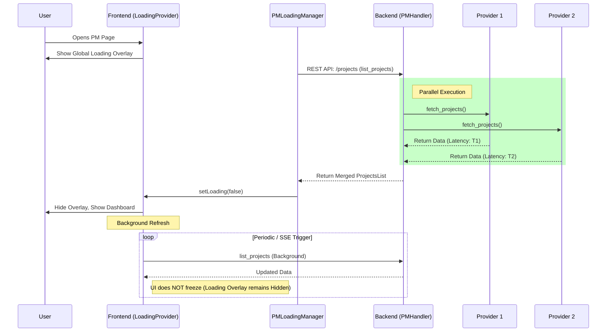

# Sequence Analysis: Project Loading Optimization

## Overview
This analysis details the optimized sequence of events for loading projects and related entities, highlighting the transition from sequential to parallel execution and the integration of the user-facing loading overlay.

## Sequence Diagram (Optimized)

## Key Improvements

1.  **Parallel Backend Fetching**:
    *   **Before**: `Total Time = Sum(Provider_Latencies)`
    *   **After**: `Total Time = Max(Provider_Latencies)`
    *   **Impact**: Significant reduction in loading time, especially with slow providers.

2.  **Blocking Loading Overlay**:
    *   **Implementation**: `LoadingProvider` + `LoadingScreen`
    *   **Behavior**: Blocks user interaction during the critical initial load phase, preventing "empty state" confusion and interaction with incomplete data.

3.  **Background Refresh**:
    *   **Before**: Refresh triggered global `loading=true`, causing UI freeze/flash.
    *   **After**: Refresh keeps `loading=false` locally, updating data silently when available.
